# Cognito Backend API Documentation
## For Frontend Integration

**Base URL:** `/cognito/api/v1`  
**WebSocket URL:** `ws://[host]/ws/lesson/{sessionId}?token={JWT_TOKEN}`

---

## Table of Contents
1. [Authentication Flow](#1-authentication-flow)
2. [User Management](#2-user-management)
3. [Class Management](#3-class-management)
4. [Lesson Session (WebSocket)](#4-lesson-session-websocket)
5. [Data Models](#5-data-models)
6. [Error Handling](#6-error-handling)

---

# 1. Authentication Flow

All endpoints (except signup/login) require JWT token in header:
```
Authorization: Bearer {JWT_TOKEN}
```


### 1.1 Signup
**`POST /signup`**

**Request Body:**
```json
{
  "email": "user@example.com",
  "fullName": "John Doe",
  "password": "securePassword123"
}
```

**Response:** `200 OK`
```
"Otp Sent Successfully"
```

---

### 1.2 Verify Signup
**`POST /verify-signup`**

**Query Parameters:**
| Parameter | Type   | Required | Description |
|-----------|--------|----------|-------------|
| `otp`     | String | ✅       | 8-digit OTP from email |
| `email`   | String | ✅       | User's email address |

**Response:** `200 OK`
```
eyJhbGciOiJIUzI1NiIsInR5cCI6IkpXVCJ9...
```
> Returns JWT token as plain text

---

### 1.3 Login
**`POST /login`**

**Request Body:**
```json
{
  "email": "user@example.com",
  "password": "securePassword123"
}
```

**Response:** `200 OK`
```
"Otp Sent Successfully"
```

---

### 1.4 Verify Login
**`POST /verify-login`**

**Query Parameters:**
| Parameter | Type   | Required | Description |
|-----------|--------|----------|-------------|
| `otp`     | String | ✅       | 8-digit OTP from email |
| `email`   | String | ✅       | User's email address |

**Response:** `200 OK`
```
eyJhbGciOiJIUzI1NiIsInR5cCI6IkpXVCJ9...
```

---

### 1.5 Reset Password
**`POST /resetPassword`**

**Request Body:**
```json
{
  "email": "user@example.com"
}
```

**Response:** `200 OK`
```
"Otp Sent Successfully"
```

---

### 1.6 Verify Reset Password
**`POST /verify-resetPassword`**

**Query Parameters:**
| Parameter     | Type   | Required | Description |
|---------------|--------|----------|-------------|
| `otp`         | String | ✅       | 8-digit OTP |
| `email`       | String | ✅       | User's email |
| `newPassword` | String | ✅       | New password |

**Response:** `200 OK`
```
"Password Reset Successfully"
```

---

# 2. User Management

### 2.1 Get Current User
**`GET /me`** 🔒 *Requires Auth*

**Response:** `200 OK`
```json
{
  "email": "user@example.com",
  "fullName": "John Doe",
  "profilePicture": "https://...",
  "availableToken": 1000,
  "createdAt": "2026-01-15T10:30:00",
  "stats": {
    "currentStreak": 5,
    "totalMinutesSpent": 3600,
    "lessonsCompleted": 12,
    "globalRank": 156,
    "weeklyGoalHours": 10,
    "lastActiveAt": "2026-02-01T14:00:00"
  }
}
```

---

### 2.2 Update Profile
**`PUT /users/me`** 🔒 *Requires Auth*

**Request Body:**
```json
{
  "base64Image": "data:image/png;base64,iVBORw0KGgoAAAANSUhEUgAA...",
  "weeklyGoalHours": 15
}
```
> Both fields are optional

**base64Image Format:**
- Must include data URI prefix: `data:image/{type};base64,{data}`
- Supported types: `png`, `jpeg`, `jpg`, `gif`, `webp`
- Example: `data:image/png;base64,iVBORw0KGgoAAAANSUhEUg...`

**Response:** `200 OK`
```
"Profile Updated Successfully"
```

---

# 3. Class Management


> **Note:** Lesson units are included in the `MyClass` response when creating a class. No separate endpoint needed.

### 3.1 Create Topic Class
**`POST /topic_class_creation`** 🔒 *Requires Auth*

Creates a new class based on a topic. AI generates syllabus automatically.

**Request Body:** Plain text (topic string)
```
"Introduction to Machine Learning"
```

**Response:** `200 OK`
```json
{
  "id": 123,
  "title": "Introduction to Machine Learning",
  "learningMode": "TOPIC_TUTOR",
  "classStatus": "ACTIVE",
  "classCompletionPercentage": 0.0,
  "lessons": 5,
  "lessonUnits": [
    {
      "unitType": "LESSON",
      "unitOrder": 0,
      "title": "What is Machine Learning?",
      "unitStatus": "NOT_STARTED",
      "lessonObjective": "Understand the fundamentals...",
      "createdAt": "2026-02-01T10:00:00"
    },
    {
      "unitType": "LESSON",
      "unitOrder": 1,
      "title": "Supervised Learning",
      "unitStatus": "NOT_STARTED",
      "lessonObjective": "Learn about supervised...",
      "createdAt": "2026-02-01T10:00:00"
    }
  ],
  "createdAt": "2026-02-01T10:00:00",
  "updatedAt": "2026-02-01T10:00:00"
}
```

---

### 3.2 Get User's Classes
**`GET /classes`** 🔒 *Requires Auth*

**Response:** `200 OK`
```json
[
  {
    "id": 123,
    "title": "Introduction to Machine Learning",
    "learningMode": "TOPIC_TUTOR",
    "classStatus": "ACTIVE",
    "classCompletionPercentage": 40.0,
    "lessons": 5,
    "createdAt": "2026-02-01T10:00:00",
    "updatedAt": "2026-02-01T12:00:00"
  }
]
```

---

### 3.3 Get Recent Classes
**`GET /classes/recent`** 🔒 *Requires Auth*

Returns last 5 recently accessed classes.

**Response:** Same as 3.2

---

### 3.4 Start Lesson
**`POST /lessons/start`** 🔒 *Requires Auth*

Initializes a lesson session and returns session ID for WebSocket connection.

**Request Body:**
```json
{
  "classId": 123,
  "unitIndex": 0
}
```
> `unitIndex` is optional, defaults to `0` (first lesson)

**Response:** `200 OK`
```json
{
  "sessionId": "sess_abc123xyz789"
}
```

> **⚠️ Important:** Use this `sessionId` to connect to WebSocket

---

# 4. Lesson Session (WebSocket)

## Connection

**URL:** `ws://[host]/ws/lesson/{sessionId}?token={JWT_TOKEN}`


---

## 4.1 Messages FROM Frontend → Backend

### STEP_COMPLETED
Sent when user finishes current step.

```json
{
  "type": "STEP_COMPLETED",
  "data": {}
}
```

---

### USER_QUESTION
Ask clarification during lesson.

```json
{
  "type": "USER_QUESTION",
  "data": {
    "questionText": "Can you explain neural networks again?",
    "audioData": "base64EncodedAudio..."
  }
}
```
> `audioData` is optional (for voice questions)

---

### PING
Keep-alive heartbeat.

```json
{
  "type": "PING"
}
```

---

## 4.2 Messages FROM Backend → Frontend

### INITIALIZING
Lesson steps are being generated.

```json
{
  "type": "INITIALIZING",
  "message": "Preparing your lesson..."
}
```

---

### NEXT_STEP
Delivers lesson content.

```json
{
  "type": "NEXT_STEP",
  "step": {
    "stepType": "NORMAL",
    "stepPayload": {
      "textToSpeak": "Machine learning is a subset of AI...",
      "canvasHtmlContent": "<div class='lesson'>...</div>",
      "quizzesJson": [
        {
          "question": "What is supervised learning?",
          "options": [
            "Learning with labeled data",
            "Learning without data",
            "Learning with unlabeled data",
            "None of the above"
          ],
          "correctAnswerIndex": 0
        }
      ]
    }
  }
}
```

**Step Types:**
| Type | Description |
|------|-------------|
| `NORMAL` | Regular lesson step |
| `CLARIFICATION` | Response to user question |
| `CONCLUSION` | Final step of lesson |

---

### AUDIO_CHUNK
Streamed audio for text-to-speech.

```json
{
  "type": "AUDIO_CHUNK",
  "chunkIndex": 0,
  "audioData": "base64EncodedOggOpusData...",
  "isLast": false,
  "encoding": "ogg-opus"
}
```

> **Audio Handling:**
> - Chunks arrive in order (`chunkIndex`)
> - Buffer and play sequentially
> - `isLast: true` indicates final chunk

---

### AUDIO_END
All audio chunks delivered.

```json
{
  "type": "AUDIO_END",
  "totalChunks": 12
}
```

---

### AUDIO_ERROR
Audio generation failed.

```json
{
  "type": "AUDIO_ERROR",
  "message": "Failed to generate audio"
}
```

---

### LOAD_INSTRUCTION
Processing user question.

```json
{
  "type": "LOAD_INSTRUCTION",
  "message": "Generating answer..."
}
```

---

### CLARIFICATION_RESPONSE
Answer to user question (priority delivery).

```json
{
  "type": "CLARIFICATION_RESPONSE",
  "priority": true,
  "step": {
    "stepType": "CLARIFICATION",
    "stepPayload": {
      "textToSpeak": "Great question! Neural networks are...",
      "canvasHtmlContent": "<div class='clarification'>...</div>",
      "quizzesJson": null
    }
  }
}
```

---

### SESSION_COMPLETED
Lesson finished successfully.

```json
{
  "type": "SESSION_COMPLETED",
  "message": "Congratulations! You've completed the lesson.",
  "stats": {
    "totalStepsConsumed": 8,
    "durationSeconds": 1800
  }
}
```

---

### PONG
Response to PING.

```json
{
  "type": "PONG"
}
```

---

### ERROR
Something went wrong.

```json
{
  "type": "ERROR",
  "message": "Error description"
}
```

---

# 5. Data Models

## 5.1 Enums

### LearningMode
```typescript
type LearningMode = "TOPIC_TUTOR" | "PDF_TUTOR" | "YOUTUBE_TUTOR";
```

### ClassStatus
```typescript
type ClassStatus = "ACTIVE" | "COMPLETED" | "ARCHIVED";
```

### UnitStatus
```typescript
type UnitStatus = "NOT_STARTED" | "IN_PROGRESS" | "COMPLETED";
```

### UnitType
```typescript
type UnitType = "LESSON" | "QUIZ" | "RECAP";
```

### StepType
```typescript
type StepType = "NORMAL" | "CLARIFICATION" | "CONCLUSION";
```

---

## 5.2 TypeScript Interfaces

```typescript
interface MyClass {
  id: number;
  title: string;
  learningMode: LearningMode;
  classStatus: ClassStatus;
  classCompletionPercentage: number;
  lessons: number;
  lessonUnits?: LessonUnit[];
  createdAt: string; // ISO datetime
  updatedAt: string;
}

interface LessonUnit {
  unitType: UnitType;
  unitOrder: number;
  title: string;
  unitStatus: UnitStatus;
  lessonObjective: string;
  createdAt: string;
}

interface PlanStep {
  stepType: StepType;
  stepPayload: StepPayload;
}

interface StepPayload {
  textToSpeak: string;
  canvasHtmlContent: string | null;
  quizzesJson: QuizQuestion[] | null;
}

interface QuizQuestion {
  question: string;
  options: string[];
  correctAnswerIndex: number;
}

interface UserDTO {
  email: string;
  fullName: string;
  profilePicture: string | null;
  availableToken: number;
  createdAt: string;
  stats: UserLearningStats;
}

interface UserLearningStats {
  currentStreak: number;
  totalMinutesSpent: number;
  lessonsCompleted: number;
  globalRank: number;
  weeklyGoalHours: number;
  lastActiveAt: string;
}

interface LessonStartRequest {
  classId: number;
  unitIndex?: number; // defaults to 0
}

interface LessonStartResponse {
  sessionId: string;
}

interface WebSocketMessage {
  type: string;
  data?: Record<string, any>;
}

interface SessionStats {
  totalStepsConsumed: number;
  durationSeconds: number;
}
```

---

# 6. Error Handling

## HTTP Status Codes

| Code | Meaning |
|------|---------|
| `200` | Success |
| `400` | Bad Request (validation error) |
| `401` | Unauthorized (missing/invalid token) |
| `403` | Forbidden (insufficient permissions) |
| `404` | Not Found |
| `500` | Internal Server Error |

## WebSocket Error Handling


---

# Complete Flow Diagram

```mermaid
flowchart TB
    subgraph Auth ["🔐 Authentication"]
        A1[Signup/Login] --> A2[Verify OTP]
        A2 --> A3[Get JWT Token]
    end

    subgraph Class ["📚 Class Management"]
        B1[Create Topic Class] --> B2[AI Generates Syllabus]
        B2 --> B3[Class with Units Created]
        B4[Get Classes List]
        B5[Get Lesson Units]
    end

    subgraph Lesson ["🎓 Lesson Session"]
        C1[POST /lessons/start] --> C2[Get sessionId]
        C2 --> C3[Connect WebSocket]
        C3 --> C4{Steps Ready?}
        C4 -->|Yes| C5[NEXT_STEP + Audio]
        C4 -->|No| C6[INITIALIZING]
        C6 --> C7[Wait for AI]
        C7 --> C5
        C5 --> C8[User Interacts]
        C8 --> C9{Action?}
        C9 -->|Complete Step| C10[STEP_COMPLETED]
        C10 --> C11{More Steps?}
        C11 -->|Yes| C5
        C11 -->|No| C12[SESSION_COMPLETED]
        C9 -->|Ask Question| C13[USER_QUESTION]
        C13 --> C14[CLARIFICATION_RESPONSE]
        C14 --> C8
    end

    A3 --> B1
    A3 --> B4
    B3 --> B5
    B5 --> C1
```



---

## Quick Reference Card

| Action | Endpoint | Method |
|--------|----------|--------|
| Signup | `/signup` | POST |
| Verify Signup | `/verify-signup` | POST |
| Login | `/login` | POST |
| Verify Login | `/verify-login` | POST |
| Reset Password | `/resetPassword` | POST |
| Verify Reset | `/verify-resetPassword` | POST |
| Get Current User | `/me` | GET 🔒 |
| Update Profile | `/users/me` | PUT 🔒 |
| Create Topic Class | `/topic_class_creation` | POST 🔒 |
| Get My Classes | `/classes` | GET 🔒 |
| Get Recent Classes | `/classes/recent` | GET 🔒 |
| Start Lesson | `/lessons/start` | POST 🔒 |
| **WebSocket** | `/ws/lesson/{sessionId}` | WS 🔒 |

🔒 = Requires `Authorization: Bearer {token}` header

---

*Documentation generated: February 1, 2026*  
*Backend Version: Spring Boot 3.5.9*
