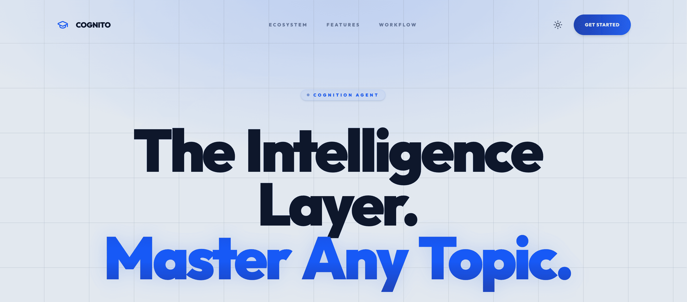

# Cognito — AI-Powered Personal Tutor

> Turn any topic, YouTube video, or PDF into an interactive lesson with a personal AI tutor.

**Live App**: [cognito.software](https://cognito.software)



## What is Cognito?

Cognito is an AI-powered educational platform for self-directed learners. Instead of passively watching videos or reading documents, Cognito transforms any learning material into a structured, interactive lesson taught by an AI tutor named **Ajibade**.

Ajibade doesn't just present information. It teaches with voice narration, generates real-time whiteboard visuals, asks adaptive quiz questions, and answers follow-up questions mid-lesson. The experience mirrors having a private tutor available anytime, on any subject.

---

## OpenAI Build Week — What Was Built

### GPT-5.6 Integration

Cognito uses **GPT-5.6** to power the **AI Study Insights** feature — a personalized learning analytics engine accessible at `/insights`.

When a learner clicks "Generate Insights," the frontend sends an authenticated request to Cognito's backend at `POST /cognito/api/v1/study-insights`. The backend uses the learner's JWT to retrieve their progress and study data, constructs the GPT-5.6 request, and returns the personalized insight response. The browser does not assemble the AI prompt or send a learner-data payload for this feature.

GPT-5.6 analyzes the learner's real data and returns:

- **Overall Assessment** — A personalized evaluation of the learner's progress and study habits
- **Strengths & Areas to Improve** — Specific observations based on actual class performance
- **Prioritized Recommendations** — Actionable next steps ranked by urgency
- **Personalized Weekly Plan** — Suggested daily study minutes and focus areas
- **Next Topics to Learn** — Contextual suggestions based on what the learner has studied
- **Motivational Note** — A personalized message from Ajibade

The analysis references the learner's actual classes by name and tailors every recommendation to their specific data. Nothing is generic.

**Architecture:**

```
React Frontend → Cognito Backend `/study-insights` → OpenAI GPT-5.6 API
```

The frontend's shared Axios client attaches the learner's JWT automatically. OpenAI credentials, prompt construction, learner-data lookup, and GPT-5.6 calls are all owned by the backend.

**Key files:**
- `src/lib/services/apiClient.ts` — Authenticated Axios client used for backend requests
- `src/lib/services/insightsService.ts` — Calls `POST /study-insights` with no client-side payload
- `src/lib/hooks/useInsights.ts` — React Query mutation hook
- `src/pages/dashboard/Insights.tsx` — Insights dashboard page

### Codex Usage

OpenAI Codex was used as the primary development tool during Build Week to:

- Architect and implement the AI Study Insights feature (backend-integrated service layer, React hook, and UI page)
- Maintain type safety and consistency with the existing codebase patterns
- Define the frontend contract for GPT-5.6's structured insight response

---

## Core Features

### Multi-Modal Learning

| Mode | How It Works |
|---|---|
| **Topic Tutor** | Type any subject. Cognito generates a structured curriculum with multiple lesson units. |
| **YouTube Tutor** | Paste a YouTube URL. The video is segmented into timed lesson chunks with AI-guided pause points, explanations, and quizzes. |
| **PDF Tutor** | Upload a document. The AI breaks it into digestible lesson units with guided explanations. |

### Ajibade AI Tutor

Ajibade is the central learning experience. During any lesson session:

- **Voice narration** — Real-time text-to-speech via streaming OGG/Opus audio chunks over WebSocket
- **Interactive whiteboard** — AI-generated visual content rendered alongside the narration
- **Live Q&A** — Ask questions mid-lesson and receive clarification responses immediately
- **Adaptive quizzes** — AI-generated quiz questions embedded into the lesson flow

### AI Study Insights (GPT-5.6)

A dedicated analytics page (`/insights`) where GPT-5.6 reviews your entire learning history and generates a personalized study strategy. Includes strengths analysis, improvement areas, prioritized recommendations, a weekly plan, and topic suggestions.

### Progress Tracking

- **Learning streaks** — Daily consistency tracking
- **Time analytics** — Total minutes spent learning
- **Completion tracking** — Per-class and per-unit progress
- **Global ranking** — Learner leaderboard
- **Weekly goals** — Configurable hour targets with progress visualization

---

## Tech Stack

### Frontend
- **React 18** + **TypeScript**
- **Vite 5** — Dev server and build tool
- **Tailwind CSS 4** — Utility-first styling with Lightning CSS
- **Framer Motion 11** — Animations and transitions
- **Zustand** — Client state management
- **TanStack React Query** — Server state and caching
- **React Router 6** — Client-side routing
- **Zod** — Runtime validation

### Backend Integration
- **RESTful API** — Authentication, class management, user profiles
- **WebSocket** — Real-time bidirectional lesson sessions
- **Audio streaming** — Chunked OGG/Opus delivery for voice synthesis

### AI / Backend
- **OpenAI GPT-5.6** — Personalized study insights generated by the Cognito backend
- **Authenticated REST endpoint** — `POST /cognito/api/v1/study-insights` retrieves learner context server-side

---

## Architecture

```
+------------------------------+
| Frontend                     |
| React + TypeScript + Vite    |
|                              |
| Dashboard / Classes /        |
| Lessons / AI Study Insights  |
+--------------+---------------+
               |
               | Axios request with JWT
               v
+------------------------------+
| Cognito Backend              |
| /cognito/api/v1              |
|                              |
| Auth, classes, lessons,      |
| and /study-insights          |
+--------------+---------------+
               |
               | Retrieves learner context,
               | builds the prompt, and calls AI
               v
+------------------------------+
| OpenAI GPT-5.6               |
| Structured study insights    |
+------------------------------+
```

---

## Project Structure

```
root/
├── src/
│   ├── components/
│   │   ├── ui/                  # Atomic UI (Button, Card, Input)
│   │   ├── layout/              # AppLayout, Header, Landing sections
│   │   ├── features/            # Ajibade chat panel
│   │   ├── lesson/              # Lesson session components
│   │   └── shared/              # StatsCard, RecentActivity
│   ├── config/
│   │   └── routes.tsx           # Centralized route config
│   ├── lib/
│   │   ├── services/            # API client, auth, class, insights
│   │   ├── store/               # Zustand stores (auth, toast)
│   │   ├── hooks/               # Business logic hooks
│   │   │   ├── activity/        # WebSocket + Audio orchestration
│   │   │   └── useInsights.ts   # GPT-5.6 insights mutation
│   │   ├── types/               # TypeScript interfaces
│   │   └── validation/          # Zod schemas
│   ├── pages/
│   │   ├── dashboard/           # Dashboard, Classes, Insights, Settings
│   │   ├── auth/                # Login, Signup, OTP, Password Reset
│   │   ├── home/                # Landing, Privacy, Terms
│   │   └── teach-me/            # Lesson creation + session pages
│   └── styles/
│       └── globals.css          # Design tokens + Tailwind config
├── vercel.json
├── vite.config.ts
└── package.json
```

---

## Getting Started

### Prerequisites
- Node.js 18+
- npm

### Installation

```bash
git clone <repository-url>
cd Cognito
npm install
```

### Environment Variables

Create a `.env` file:

```env
VITE_API_BASE_URL=https://your-backend-url.com/cognito/api/v1
VITE_WS_URL=wss://your-backend-url.com/ws/lesson/
```

The GPT-5.6 API key is configured in the Cognito **backend** environment. It is not a Vite environment variable and must never be exposed in this frontend repository or the browser.

### Development

```bash
npm run dev        # Start dev server at http://localhost:5173
npm run build      # Production build
npm run preview    # Preview production build
```

---

## Routes

| Path | Description | Auth |
|---|---|---|
| `/` | Landing page | No |
| `/login` | User login | No |
| `/signup` | User registration | No |
| `/verify-otp` | OTP verification | No |
| `/forgot-password` | Password reset | No |
| `/dashboard` | Main dashboard | Yes |
| `/classes` | All classes | Yes |
| `/teach-me/*` | Create topic/YouTube/PDF class | Yes |
| `/teach-me/class/units` | View class units | Yes |
| `/insights` | AI Study Insights (GPT-5.6) | Yes |
| `/settings` | User settings | Yes |
| `/quiz` | Quiz mode | Yes |
| `/community` | Community | Yes |

---

## Learning Flow

1. **Create a Class** — Choose Topic, YouTube, or PDF mode
2. **View Curriculum** — See AI-generated lesson units
3. **Start Lesson** — Begin an interactive WebSocket-powered session
4. **Learn with Ajibade** — Voice narration, whiteboard visuals, live Q&A
5. **Complete Quizzes** — Test understanding with adaptive questions
6. **Track Progress** — Monitor streaks, time, and completion
7. **Get AI Insights** — GPT-5.6 analyzes your learning data and generates a personalized study strategy

---

## Authentication Flow

1. **Signup** → Email OTP verification → Auto-login with JWT
2. **Login** → Email OTP verification → Dashboard
3. **Password Reset** → OTP → Set new password → Login

JWT tokens stored in HTTP-only cookies. Automatic session management with interceptor-based logout on 401/403.

---

## Built With

- React · TypeScript · Vite · Tailwind CSS 4 · Framer Motion
- Zustand · TanStack React Query · React Router · Zod
- WebSocket · OGG/Opus Audio Streaming
- **OpenAI GPT-5.6** · Cognito backend study-insights API
- **OpenAI Codex** (development tool)

---

## Contributors

| Contributor | GitHub |
|---|---|
| **Mosimiloluwa Adebisi** | [@A-Simie](https://github.com/A-Simie) |
| **Amina** | [@aminatukekere](https://github.com/aminatukekere) |
| **Rahmannugar** | [@Rahmannugar](https://github.com/Rahmannugar) |

---

## License

MIT
